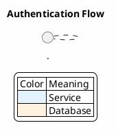

# Diagram Rules — PlantUML File Organization

> Source: PlantUML diagram storage and naming conventions for this monorepo

## 📁 Documentation Structure

### ✅ All diagrams go in `docs/` organized by section
```
docs/
├── architecture/
│   ├── diagrams/
│   │   ├── system-overview.puml
│   │   ├── system-overview.svg
│   │   ├── deployment.puml
│   │   ├── deployment.svg
│   │   ├── monorepo-structure.puml
│   │   └── monorepo-structure.svg
│   └── README.md
├── business/
│   ├── diagrams/
│   │   ├── user-registration-flow.puml
│   │   ├── user-registration-flow.svg
│   │   ├── order-lifecycle.puml
│   │   ├── order-lifecycle.svg
│   │   └── ...
│   └── README.md
├── services/
│   ├── auth/
│   │   ├── diagrams/
│   │   │   ├── auth-flow.puml
│   │   │   ├── auth-flow.svg
│   │   │   ├── jwt-lifecycle.puml
│   │   │   └── jwt-lifecycle.svg
│   │   └── README.md
│   ├── api/
│   │   ├── diagrams/
│   │   │   ├── crud-lifecycle.puml
│   │   │   └── crud-lifecycle.svg
│   │   └── README.md
│   └── web/                    ← frontend service(s)
│       ├── diagrams/
│       │   ├── component-tree.puml
│       │   ├── component-tree.svg
│       │   ├── page-routing.puml
│       │   └── page-routing.svg
│       └── README.md
└── appendix/
    ├── diagrams/
    │   ├── er-diagram.puml
    │   ├── er-diagram.svg
    │   ├── glossary.puml
    │   └── glossary.svg
    └── README.md
```

### Section Purpose

| Section | Content |
|---------|---------|
| `architecture/` | System overview, deployment, infrastructure, monorepo structure, network topology |
| `business/` | Domain flows, user journeys, business rules, state machines, process workflows |
| `services/auth/` | Auth service endpoints, JWT flow, token lifecycle, password reset |
| `services/api/` | API service endpoints, CRUD flows, query patterns |
| `services/web/` | Frontend component tree, page routing, state management, UI flows |
| `services/<name>/` | Any additional service (add per service) |
| `appendix/` | ER diagrams, glossary, shared data models, reference diagrams |

### ✅ Add a new subfolder for each new service
```
# Adding a new "billing" backend service
docs/services/billing/
├── diagrams/
│   ├── payment-flow.puml
│   └── payment-flow.svg
└── README.md

# Adding a new "admin" frontend
docs/services/admin-web/
├── diagrams/
│   ├── dashboard-layout.puml
│   └── dashboard-layout.svg
└── README.md
```

---

## 🏷️ File Naming

### ✅ Use kebab-case, descriptive names
```
# ❌ Bad
Auth Flow.puml          # Spaces
authFlow.puml           # camelCase
diagram1.puml           # Generic

# ✅ Good
auth-flow.puml
jwt-lifecycle.puml
user-crud-sequence.puml
deployment-architecture.puml
```

### ✅ Every .puml MUST have a matching .svg
```bash
# Always generate both
python3 .claude/skills/plantuml/scripts/plantuml.py auth-flow \
  --source docs/services/auth/diagrams/auth-flow.puml \
  --output-dir docs/services/auth/diagrams
```

---

## 🔧 Generation Workflow

### ✅ Always use the PlantUML skill script
```bash
# ❌ Bad — manual rendering or external tools
plantuml -tsvg diagram.puml

# ✅ Good — use the skill script with correct output-dir
python3 .claude/skills/plantuml/scripts/plantuml.py <name> \
  --source docs/<section>/diagrams/<name>.puml \
  --output-dir docs/<section>/diagrams
```

### ✅ Embed in markdown with relative paths
```markdown
<!-- ❌ Bad — absolute path -->


<!-- ✅ Good — relative path from docs root -->


<!-- ✅ Good — relative path from repo root -->

```

---

## 📐 Diagram Content Rules

### ✅ Every diagram MUST have a title and legend when needed


### ✅ Use consistent styling across all diagrams
```plantuml
skinparam backgroundColor #FEFEFE
skinparam shadowing false
skinparam defaultFontName sans-serif
skinparam monochrome true
```

---

## 🚫 Checklist

- ❌ Never put diagrams in source code folders (`apps/`, `libs/`)
- ❌ Never commit only `.puml` without the rendered `.svg`
- ❌ Never use spaces or camelCase in diagram file names
- ❌ Never use absolute paths in markdown image links
- ❌ Never store diagrams flat in `docs/` without section organization
- ❌ Never mix diagrams from different sections in one folder
- ✅ Always use the 4-section structure: `architecture/`, `business/`, `services/`, `appendix/`
- ✅ Always create a `diagrams/` subfolder inside each section/service
- ✅ Always add a new `services/<name>/` subfolder for each new service
- ✅ Always generate `.svg` alongside `.puml`
- ✅ Always use kebab-case file names
- ✅ Always include a `title` in the PlantUML source
- ✅ Always use consistent `skinparam` styling
