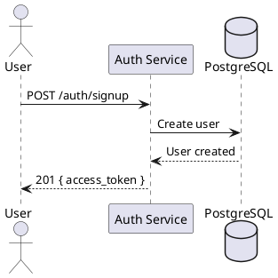
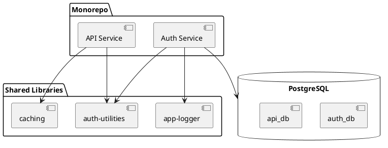
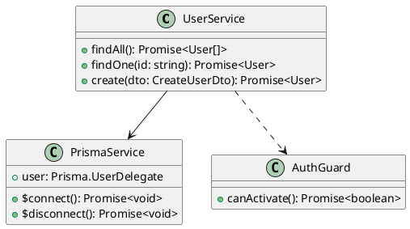
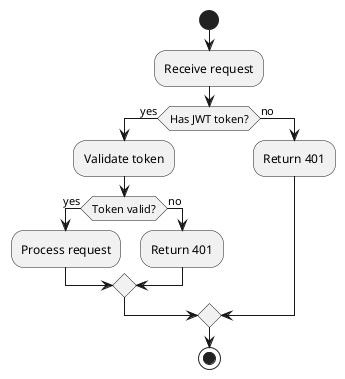
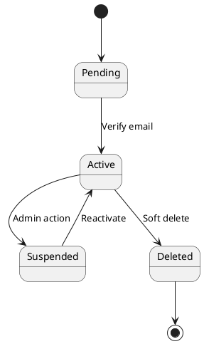
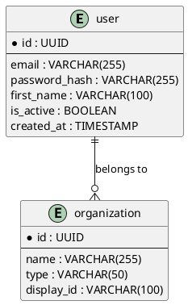
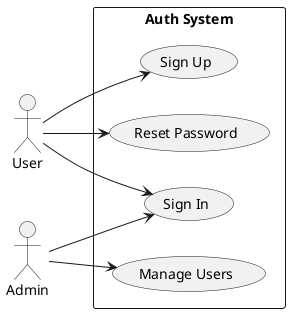

# PlantUML Diagram Generator

Generate professional PlantUML diagrams, render to SVG, and embed in markdown.

## Usage

Use the bundled script to generate diagrams:

```bash
# From inline PlantUML text
python3 .claude/skills/plantuml/scripts/plantuml.py <name> --text '<plantuml_code>'

# From a .puml file
python3 .claude/skills/plantuml/scripts/plantuml.py <name> --source docs/diagrams/<name>.puml

# Get server URL only (no download)
python3 .claude/skills/plantuml/scripts/plantuml.py <name> --text '<plantuml_code>' --url-only

# JSON output
python3 .claude/skills/plantuml/scripts/plantuml.py <name> --text '<plantuml_code>' --json
```

**Output:**
- `docs/diagrams/<name>.puml` — PlantUML source (editable)
- `docs/diagrams/<name>.svg` — Rendered SVG image
- Markdown link printed to stdout: ``

## Workflow

1. **Write PlantUML syntax** based on user's diagram request
2. **Run the script** to encode, fetch SVG, and save files
3. **Insert the markdown link** into the document

## Supported Diagram Types

### Sequence Diagrams (most common)


### Component Diagrams


### Class Diagrams


### Activity / Flow Diagrams


### State Diagrams


### ER / Database Diagrams


### Use Case Diagrams


## Styling Tips

### Clean modern look
```plantuml
skinparam backgroundColor #FEFEFE
skinparam shadowing false
skinparam defaultFontName sans-serif
skinparam monochrome true
```

### Color scheme for architecture diagrams
```plantuml
skinparam component {
  BackgroundColor #E3F2FD
  BorderColor #1565C0
}
skinparam database {
  BackgroundColor #FFF3E0
  BorderColor #E65100
}
```

## Best Practices

- Keep diagram names descriptive: `auth-flow`, `user-crud-lifecycle`, `deployment-architecture`
- Store .puml source alongside .svg for future editing
- Use `skinparam` for consistent styling across diagrams
- Use aliases (`as Auth`) to keep arrows short and readable
- Group related participants with `package` or `rectangle`
- Add notes with `note left/right/top/bottom` for important context
